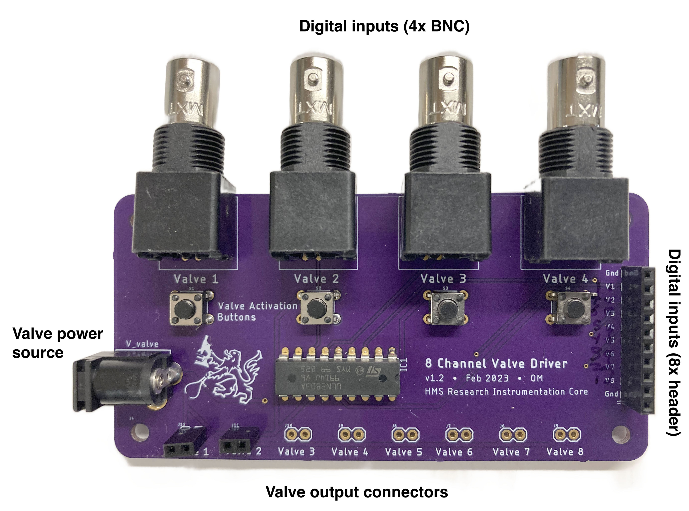

# HMS 8-Channel Valve Driver

A circuit for driving up to 8 small valves.

The board takes 8 channels of digital inputs (3.3V or 5V) and can drive valves at up to 50V and 500mA. Inputs can be connected via BNC connectors (channels 1–4) or a 0.1" header (all 8 channels). Optional push buttons on channels 1–4 allow for manual valve activation (e.g., to flush or clean the valve lines).

## Fabrication and Assembly

1) Order a batch of printed circuit boards (PCBs) using the provided Gerber files. 

2) Order the components listed in the Bill of Materials, and solder them into the PCB as shown in the photo above.

Notes:
- Make sure to place the transistor array chip (ULQ2803A) in the correct orientation (the notch on the chip should line up with the silkscreen).
- Input connectors (BNC or 1x10 header) are optional depending on how you plan to use the board and how many channels you'll need.
- Similarly, manual valve control buttons are optional.

#### Output connectors
You have several choices for the output connectors to the valves since the holes in the board have standard 0.1" spacing. Two options are shown in the images below:
- A simple 0.1" rectangular socket (or header). Some valves can just plug right in (like the Lee LHD series show in the photo).
- A 0.1" screw terminal. Makes it easier to connect directly to wires.

## Usage

1) Plug in a "wall-wart" power supply with the correct voltage for your valves (likely 5V, 12V, or 24V). Make sure the power supply can provide enough current for all the valves you plan to use (or at least as many valves as might be on at once).

2) Connect valves to the output connectors. NOTE: Make sure the valves draw 500mA or less.

3) Provide digital signals to the valve input lines. These may be 3.3V or 5V signals, and might come from a device like an Arduino or a DAQ (data acquisition) board. Make sure that the valve driver and the signal generating device share a common ground connection, either through the BNC shield, or the GND pin on the input header. The circuit will energize the valves in response to a HIGH (3–5V) input signal.

4) If needed, you can also use the buttons to manually energize the valves.

